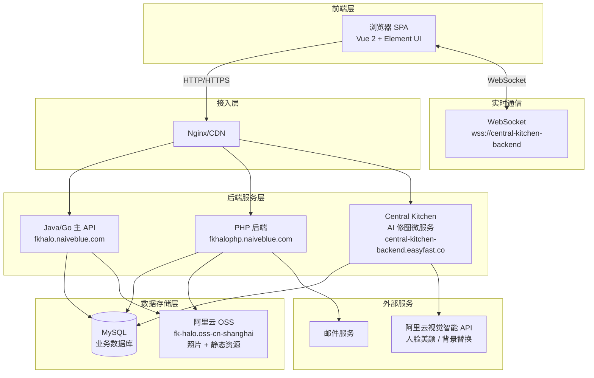
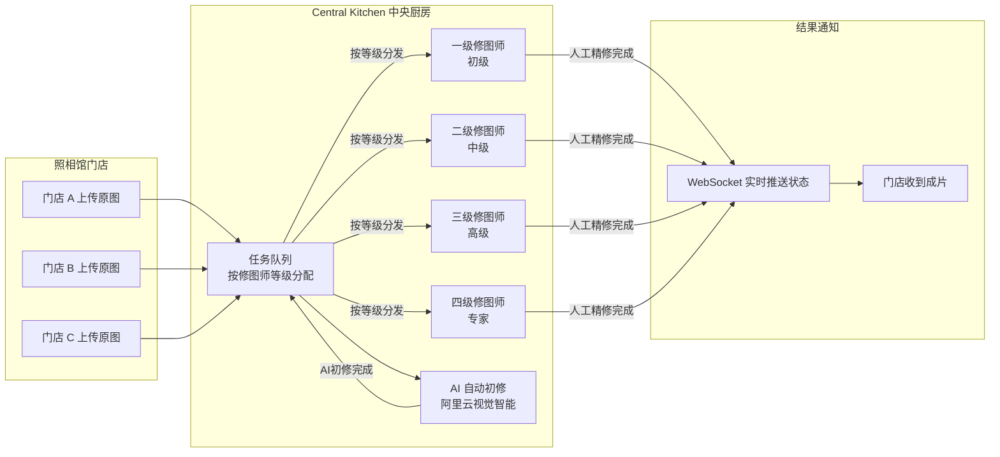
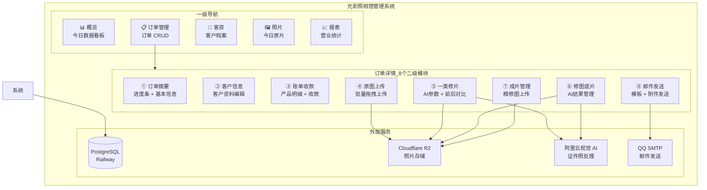

# 🔬 方快照相馆后台系统（easyfast-halo）技术分析报告

> 分析日期：2026-06-29
> 分析对象：https://easyfast-halo.naiveblue.com
> 分析人：光影照相馆技术调研

---

## 一、结论摘要

`easyfast-halo.naiveblue.com` **不是一个独立的照相馆系统**，而是一个 **SaaS 多租户平台**（由「易快 EasyFast」开发），服务于「方快」等连锁照相馆品牌。

**核心发现：**
- 🧠 **AI 修图**：「中央厨房」架构 — 独立 AI 微服务 + 4 级人工修图师体系
- 📦 **照片存储**：阿里云 OSS（`oss-cn-shanghai`）
- 🏗️ **后端架构**：Java + PHP 双后端 + WebSocket 实时通信
- 🎨 **前端**：Vue 2 + Element UI + Webpack 纯 SPA

---

## 二、技术架构全景图

### 2.1 系统架构总览



### 2.2 AI 修图「中央厨房」架构



### 2.3 照片存储架构

```mermaid
graph TB
    subgraph 用户浏览器
        U[上传照片]
        V[查看/下载照片]
    end

    subgraph 后端代理层
        P[PHP 图片代理<br/>/download/oss_img]
    end

    subgraph 阿里云 OSS
        OSS[fk-halo.oss-cn-shanghai.aliyuncs.com]
        S1[静态资源<br/>/light_halo/css/<br/>/light_halo/images/<br/>/light_halo/audio/]
        S2[业务照片<br/>/orders/{id}/original/<br/>/orders/{id}/ai_result/<br/>/orders/{id}/final/]
    end

    U -->|直传 OSS| OSS
    V -->|代理请求| P
    P -->|鉴权 + 获取| OSS
    OSS --> S1
    OSS --> S2
```

---

## 三、从 JS 源码逆向出的环境配置

在 `app.c6827e88.js`（主应用包，411KB）中发现完整环境变量：

| 环境变量 | 值 | 用途 |
|---------|---|------|
| `VUE_APP_BASE_API` | `https://fkhalo.naiveblue.com/api/v1` | 主 API（Java/Go） |
| `VUE_APP_PHP_API` | `https://fkhalophp.naiveblue.com/api/v1` | PHP 后端 API |
| `VUE_APP_CENTRAL_KITCHEN_API` | `https://central-kitchen-backend.easyfast.co` | 🔥 AI 修图微服务 |
| `VUE_APP_MOCK_API` | `http://localhost:3000/api/v1` | 本地 Mock 开发 |
| `VUE_APP_IMG_DOMAIN` | `https://fkhalophp.naiveblue.com/download/oss_img` | 图片下载代理 |
| `VUE_APP_WS_HOST` | `https://fkhalophp.naiveblue.com` | WebSocket HTTP 入口 |
| `VUE_APP_WSS_URL` | `wss://central-kitchen-backend.easyfast.co` | WebSocket 实时通信 |
| `VUE_APP_PHP_HOST` | `https://fkhalophp.naiveblue.com` | PHP 服务域名 |

### 静态资源 CDN 路径

```
CSS 框架：   https://fk-halo.oss-cn-shanghai.aliyuncs.com/light_halo/css/qdr/humancss/0.17/css.min2.css
应用样式：   https://fk-halo.oss-cn-shanghai.aliyuncs.com/light_halo/css/qdr/app.min.23.css
图标库：     https://fk-halo.oss-cn-shanghai.aliyuncs.com/light_halo/css/font-awesome/4.7.0/css/font-awesome.min.css
客服系统：   https://fk-halo.oss-cn-shanghai.aliyuncs.com/light_halo/css/layim.css
后台样式：   https://fk-halo.oss-cn-shanghai.aliyuncs.com/light_halo/css/console.min.3.css
Logo 白字：  https://fk-halo.oss-cn-shanghai.aliyuncs.com/light_halo/images/logo_write.png
提示音：     https://fk-halo.oss-cn-shanghai.aliyuncs.com/light_halo/audio/3424.wav
```

---

## 四、前端技术栈详解

| 层级 | 技术 | 版本/说明 |
|------|------|----------|
| **框架** | Vue 2 | `v-cloak` 指令、Options API |
| **UI 组件库** | Element UI | `chunk-elementUI.21572f18.js`（~2MB） |
| **第三方库** | chunk-libs | `chunk-libs.e2da1485.js`（axios、moment 等） |
| **构建工具** | Webpack | `webpackJsonp`，100+ 代码分块 |
| **路由** | Vue Router | Hash 模式（`/#/`） |
| **HTTP 请求** | Axios | 拦截器 + CancelToken |
| **弹窗/灯箱** | Fancybox | iframe 模式，1200×1000 |
| **即时通讯** | LayIM | 客服聊天 |
| **图标** | Font Awesome 4.7 | 免费图标集 |
| **CSS 框架** | HumanCSS 0.17 | 自研工具类 CSS 框架 |
| **日期处理** | Moment.js | `this.$moment` |

### 自定义 CSS 设计令牌

```css
主题色：      #0075C1（主蓝） / #006699（深蓝）
警告色：      #FF6666（红）
正文色：      #444444
顶部导航：    #0075C1 背景，80px 高度
按钮命名：    btn-v-main / btnl-v-warn / btnl-v-top-faded
边框命名：    bd-top-v-title / bd-left-v-title
```

---

## 五、功能模块对比分析

| 功能模块 | 方快/EasyFast | 光影照相馆（我们） | 差异 |
|---------|-------------|-----------------|------|
| **订单管理** | ✅ 多门店订单 | ✅ 单店订单 | 我们更简洁 |
| **客户管理** | ✅ 带历史订单 | ✅ 带历史订单 | 持平 |
| **原图上传** | ✅ 批量上传 | ✅ 批量拖拽 | 持平 |
| **AI 修图** | 🔥 Central Kitchen | ⚠️ sharp 本地处理 | **差距大** |
| **修图师分级** | ✅ 4 级分配 | ❌ 不需要 | — |
| **实时通知** | ✅ WebSocket | ❌ 无 | 中期可加 |
| **成片管理** | ✅ | ✅ | 持平 |
| **邮件交付** | ✅ | ✅ | 持平 |
| **经营报表** | ✅ | ✅ | 持平 |
| **账单/收款** | ✅ | ⚠️ 部分实现 | 需完善 |
| **多门店** | ✅ | ❌ 不需要 | — |
| **客服聊天** | ✅ LayIM | ❌ 不需要 | — |
| **微信选片** | ✅ | ❌ 后期规划 | — |

---

## 六、AI 修图深度对比

### 他们的方案

```
原图上传 → 阿里云视觉智能 API（自动初修）
         → Central Kitchen 任务队列
         → 4级修图师分级领取任务
         → 人工精修（保留 AI 处理不了的细节）
         → WebSocket 实时推送完成状态
         → 门店收到成片
```

**关键代码证据：**
- `is_repair_photo_user`：是否为修图师角色
- `designer_level`：1/2/3/4 级修图师
- `ai_retouching_disabled`：AI 修图开关
- `photo_num`：每人分配的照片数量
- `firstUserNums ~ forthUserNums`：各等级修图师在修数量

### 我们的方案（当前）

```
原图上传 → sharp median 滤镜 + sharpen + 色度键抠图
         → 单次 JPEG 编码
         → 返回结果
```

**问题：** sharp 是通用图像处理库，不是 AI 模型。无法做到：
- ❌ 人脸语义理解（不知道哪里是皮肤、哪里是五官）
- ❌ 自适应美颜（所有人脸用同样的 median 参数）
- ❌ 高清修复（降噪和锐化互相抵消）
- ❌ 精准抠图（色度键对复杂背景无效）

---

## 七、改进建议

### 短期（解决模糊问题）：接入阿里云视觉智能 API

```
原图 → Next.js API Route → 阿里云视觉智能 → 返回高清处理图 → 存储 R2
```

**推荐 API：**
- `人脸美颜` (FaceBeauty)：美白、磨皮、大眼、瘦脸
- `人体分割` (SegmentHuman)：精准抠图换背景
- `人脸增强` (EnhanceFace)：超分辨率修复

**成本估算：** 约 ¥0.01-0.05/张，月处理 1000 张约 ¥10-50

### 中期：自建轻量 AI Pipeline

使用开源模型部署到支持 GPU 的服务器（如 AutoDL 按量租用）：
- **抠图**：RMBG-2（BRIA AI）
- **人脸修复**：CodeFormer
- **美颜**：BeautyGAN

### 长期：Central Kitchen 模式

如果你未来服务多个门店，可以构建集中式修图中心。

---

## 八、功能架构图（完整）



---

## 九、技术选型对比总表

| 维度 | 方快/EasyFast | 光影照相馆（我们） | 评价 |
|------|-------------|-----------------|------|
| **架构模式** | 前后端分离 + 多服务 | Next.js 全栈单体 | 我们更简单，适合单店 |
| **前端框架** | Vue 2 + Element UI | React 18 + shadcn/ui | 我们更现代 |
| **后端语言** | Java + PHP | TypeScript (Node.js) | 我们技术栈统一 |
| **数据库** | MySQL（推测） | PostgreSQL | 我们更强（JSONB 等） |
| **文件存储** | 阿里云 OSS | Cloudflare R2 | 我们有出口流量免费 |
| **AI 修图** | 阿里云 API + 人工 | ~~sharp~~→ 待升级 | **差距所在** |
| **实时通信** | WebSocket | 无 | 单店可暂不需要 |
| **部署** | 独立服务器 | Vercel + Railway | 我们有免费额度 |
| **可维护性** | 多服务运维复杂 | 单体应用简单 | 我们的优势 |

---

## 十、关键结论

1. **方快的 AI 修图不是纯 AI**，是「阿里云视觉智能 API 初修 + 4 级人工修图师精修」的混合模式
2. **照片存储用的是阿里云 OSS**，通过 PHP 后端做代理下载（权限控制）
3. **这是一个 SaaS 平台**，服务多个连锁照相馆品牌，不是单店系统
4. **我们的 sharp 方案需要替换**，接入阿里云视觉智能 API 可以快速解决质量问题和 Vercel 超时问题
5. **我们其他模块已基本对标**，差距主要在 AI 修图质量和实时通知

---

*文档生成于 2026-06-29，基于 easyfast-halo.naiveblue.com 前端源码逆向分析*
